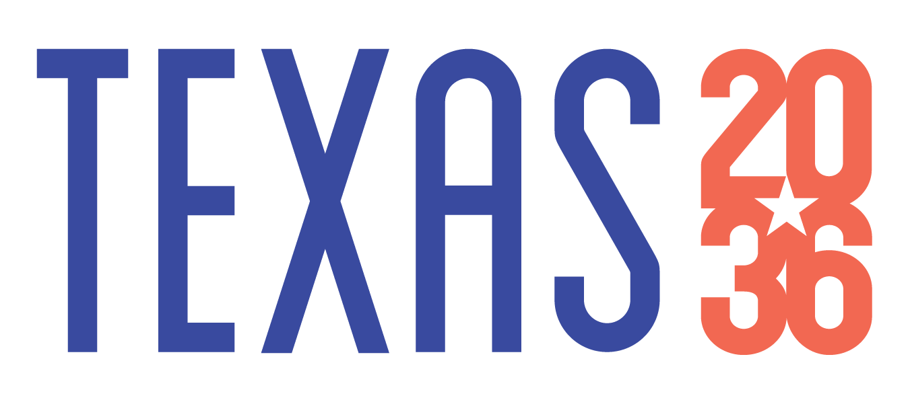

This Dashboard was developed by Texas 2036. Texas 2036 is a nonprofit organization building long-term, data-driven strategies to secure Texas’ continued prosperity for years to come. We engage Texans and their leaders in an honest conversation about our future, focusing on the big challenges. We  offer non-partisan ideas and modern solutions that are grounded in research and data to break through the gridlock on issues that matter most to all Texans. Smart strategies and systematic changes are critical to prepare Texas for the future. 

***

## Our Mission

To enable Texans to make policy decisions through accessible data, long-term planning and statewide engagement.

***

## Our Vision

Texas is the best place to live and work.

***

## Our Approach

* **Envision a stronger future through data and research**
  - Grounded in actionable and transparent data to move Texas beyond partisan, regional and generational politics.
  - Focused on the issues that matter for all Texans across the state and targeting gaps impacting our most vulnerable
* **Spur strategic action through planning, leadership and coalition-building**
  - Thinking boldly to energize and engage all Texans in inclusive and collaborative ways
  - Bringing Texans together to support critical decisions and actions for our future.
* **Ensure meaningful change through accountability**
  - Focused on results tracked over time against long-term aggregated goals
  - Driven by the need for sustainability and resiliency, stewarding our resources wisely and well.
  
***

## Our Values

> **ACTION** We believe Texans take action when faced with challenges, and that we’re proud and competitive enough to take on any challenge together. We know where the buck should stop, starting with individual and community responsibility, and extending to government accountability.

> **DIVERSITY** We believe a core value of being Texan is to be respectful, friendly and inclusive. We recognize our diversity as a strength and work towards including all Texans when setting future goals.

> **OPPORTUNITY**. We believe every Texan wants our state to be the best place to live and work, and to do that, we must promote opportunity and make sure everyone has the tools and chance to succeed.

> **PRAGMATISM**. We believe our state’s history of independence has led many Texans to be skeptical of government, but we also know Texans are practical and willing to come together to make the right – and sometimes tough – decisions when the case for action is made.

> **RESILIENCE** We believe Texans are generous, focused on family and community, and willing to help others in need, making us able to overcome any challenge facing our state now and into the future.

